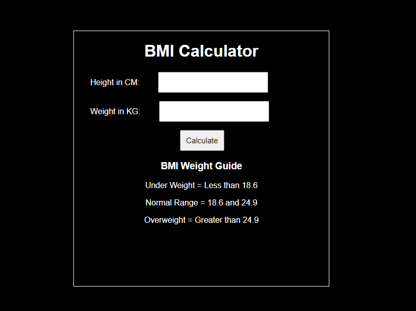
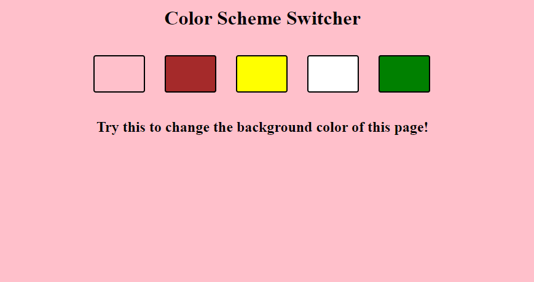

# BMI_Calculator

## Description
A simple Body Mass Index (BMI) calculator using HTML, CSS and Javascript. This tool helps you to calculate your BMI by inputting your weight and height.

## Features
- Input weight and height to calculate BMI.
- Displays the BMI value and the corresponding weight status category.

## Installation 
Clone the repository and open 'BMI_calculator.html' in your browser.
'''bash
git clone https://github.com/Ayushi2600/Basic-Javascript-Projects
cd BMI_Calculator
open BMI-calculator.html

# Color_Changer

## Description
A simple project that can help to change the background color using HTML, CSS and Javascript.

## Features
- Click a button to change the background color.
- Simple and clean user interface.

## Installation 
Clone the repository and open 'color_changer.html' in your browser.
'''bash
git clone https://github.com/Ayushi2600/Basic-Javascript-Projects
cd Color_Changer
open color_changer.html

# Digital Clock

## Description
A digital clock that displays the current time with hours, minutes, and seconds. Built using HTML, CSS, and Javascript.

## Features
- Real-time display of the current time.
- Updates every second.
- Simple and elegant design.

## Installation 
Clone the repository and open 'digital_clock.html' in your browser.
'''bash
git clone https://github.com/Ayushi2600/Basic-Javascript-Projects
cd Digital_Clock
open digital_clock.html
